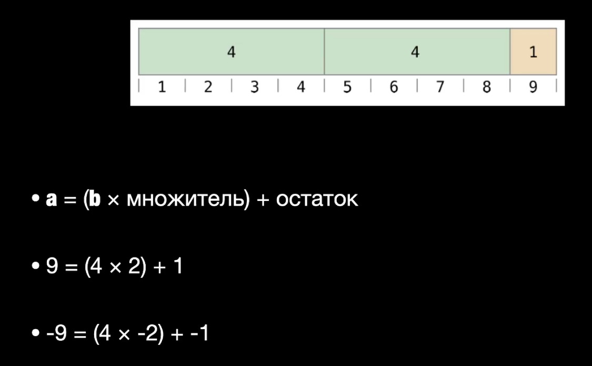
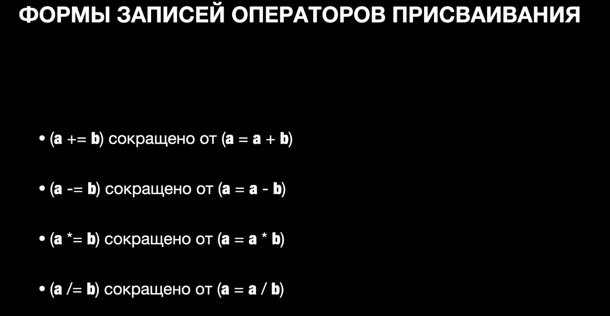

# Операторы

Есть 3 вида операторов:
- Унарные операторы (применяются к одной велечине)
- Бинарные операторы (2 величины)
- Тернарные операторы (3 величины) - аналог if else

❗️ Величины, с которыми работают операторы называются **операндами**

## Арифметические операторы

| operator | значение |
|:--|:--|
| + | сложение |
| - | вычитание |
| * | умножение |
| / | деление |

```swift
let a = 10
let b = 5

a + b // 15
a - b // 5
a * b // 50
a / b // 2
```

## Оператор остатка от деления
| operator | значение |
|:--|:--|
|% | отаток от деления |

Выражение `a % b` вычисляет остаток от деления a на b

```swift
let a = 13 % 5 // 3
```



## Операторы присваивания

| operator | значение |
|:--|:--|
| =| присвоить |
| +=| сложение |
| -= | вычитание |
| *= | умножение |
| /= | деление |



```swift 
a = 5
b = 10

a += b // a = a + b // a = 5 + 10 = 15
a -= b // a = a - b // a = 15 - 10 = 5
a *= b // a = a * b // a = 5 * 10 = 50
a /= b // a = a / b // a = 50 / 10 = 5
```

## Операторы сравнения 

| operator | значение |
|:--|:--|
| ==| сравнить |
| <= | меньше-равен |
| >= | больше-равен |
| != | не-равен |
| < | меньше |
| > | больше |

```swift
a == b // false
a != b // true
a > b // false
a < b // true
a >= b // false
a <= b // true
```

## Операторы диапазаона

### Замкнутый диапазон `a...b`
```swift
1…3 // 1, 2, 3
```
### Полузамкнутый диапазон `a..<b`
```swift
1..<3 // 1, 2
```

❗️ `a` не может быть больше `b`

<br></br>

### Односторонинй диапазон `a...`

```swift
1… // 1, 2, 3, ..., n
```

## Логические операторы
| operator | значение |
|:--|:--|
| ! | не |
| && | и |
| \|\| | или |

<br></br>

# Строки и символы
❗️ Любая строка - есть коллекция

Инициализация строки и присваивание строки
```swift
let name: String
var surname = String()
var email = ""

name = "Алексей"
surname = "Ефимов"
```
Многострочный литерал строки
```swift
var aboutCourse = """
Курс: "Основы программирования на Swift"
Количество уроков: 8
Уроков пройдено: 2
Уроков осталось: 6
Автор и ведущий курса: Алексей Ефимов
"""
```

## Конкатенация строк

*Конкатенация* - сложение строк вместе
```swift
let str1 = "Hi"
let str2 = " I'm Igor"
let str3 = srt1 + str2 // "Hi I'm Igor" 
```

## Интерполяция строк

*Интерполяция* - иньекция значений внутрь строки
```swift
let str1 = "Hi"
let str2 = "\(str1) I'm Igor" // "Hi I'm Igor" 
```

В строку можно внедрять вычисления, а не только свойства
```swift    
let a = 10

let str = "This is \(a + 5)" // "This is 15"
```
❗️ Не нужно вычисляемое значение сразу интерполировать, нужно присвоить его к свойству, а потом вывести свойство

Нитерполяция так же работает с многострочными строками

## Различия канката и интера
Канкат нужен, в случае, если идет сетевой запрос, используется URL. Складываем несколько URL адресов и получаем один, полный URL адрес.
