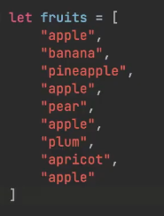
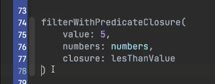

Стиль кода:
- Никакой кириллицы, комментариев на русском языке  так же быть не должно
- Транслит не используется
- Мало комметрариев - плохо, много комментариев - плохо. Комментировать нужно неочевидные вещи
- Свойства и функции нужно называть по смыслу
- Лишний код - плохой код. Чем меньше информации в коде - тем легче воспринимать код. Например, не нужно явно указывать все типы данных свойств
- Название **свойств** и **функций** должно быть в стиле camelCase с маленькой буквы (ВСЕГДА с маленькой)
- **Свойства** нужно использовать - неиспользуемые свойства создавать не нужно
- В одну строку стоит объявлять только те свойства, которые не требуется сразу же их инициализировать
- Лучше не создавать кучу скобок, лучше перепесывать выражения так, чтобы скобок было меньше
- Указывать тип данных явно стоит только тогда, когда компилятор не понимает, какой тип данных будет в свойстве (бывают исключения, когда компания требует явного указания всех свойств). Тоже самое со свойствами коллекций.)
- В случае приведении типа свойств, лучше приводить сразу к тому, что хочется получить в результате, стоит избегать промежуточных типов
- Длина строки не более 80 символов

Коллекции:
- Индекс элемента массива должен вычисляться программно. (Индексы не прнято указывать в виде числового значения напрямую)

Функции:
- В случае, если функция умещается в одну строку, слово return стоит опустить
- 

Классы:

 

| Правильное отображение структуры в коде | Пример |
|:--|:--|
| Коллекции |  |
| Функции с параметрами |  |