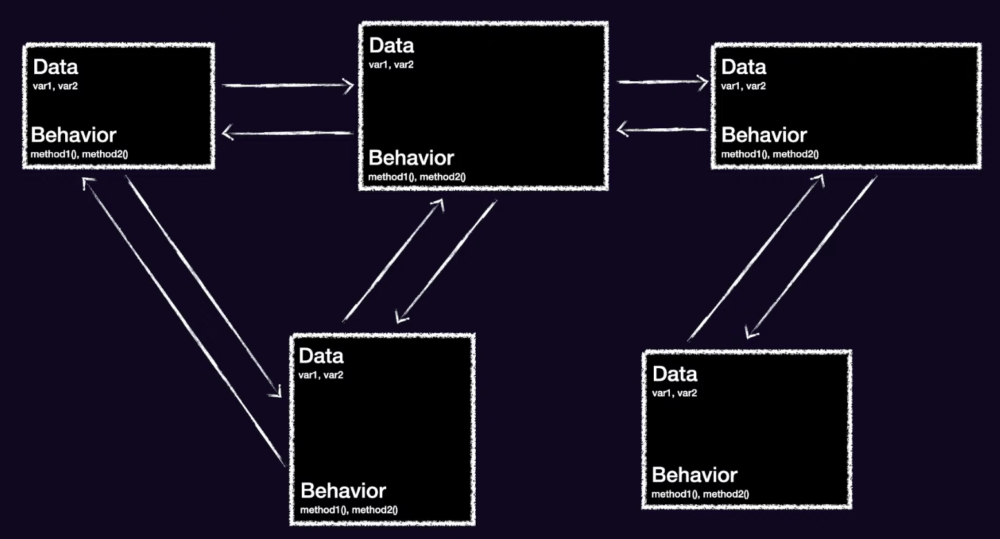

<!-- Урок 6. ООП в Swift -->

- [ООП в Swift](#ооп-в-swift)
---

# ООП в Swift

Объектно-ориентированное программирование - это фундаментальная парадигма программирования, которая берет своё начало с 1950-х годов и является проверенным способом построения сложных систем

В ООП всё состоит из объектов

Любая ООП программа - это набор взаимодействующих между собой компонентов (объектов) 

Ответсвенность за работу приложения распределена между всеми объектами

Каждый объект имеет своё значение и роль

Хорошо спроектированная программа позволяет работать над функционалом программы в виде модулей. Это позволяет расширать программу каждому из разработчиков не зная логики работы всей программы в целом

